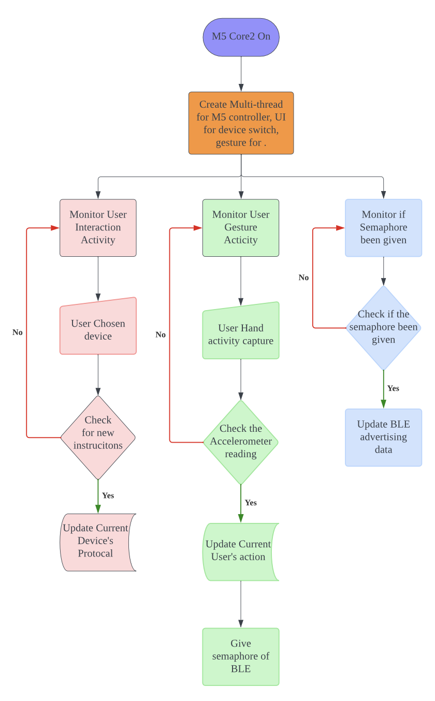

# CSSE4011-FinalProject
Final Projct for CSSR4011 in UQ 2024

# Key Performance Indicator
## 1. Gesture Input Recognition via Accelerometer:
The M5core2's onboard accelerometer is to be calibrated and programmed to detect specific motion gestures. These gestures will serve as inputs to control various functions of infrared devices. Detailed metrics will be established to measure the accuracy and responsiveness of gesture recognition.

## 2. Bluetooth Communication Efficiency:
Establish a robust Bluetooth communication protocol between the M5core2 and NRF_52840DK boards. The performance will be measured based on connection stability, data transmission speed, and error rate. A seamless transmission of commands with minimal latency is critical for a positive user experience.

## 3. User Interface (UI) Development on M5core2:
Design an intuitive UI to be displayed on the M5core2 screen, which will show real-time gesture recognition feedback and command statuses. Effectiveness will be judged based on the UI's ease of use, clarity, and the user's ability to navigate and execute control functions without confusion or delay.

## 4. IR Signal Encoding Accuracy:
Program the NRF52840DK to accurately encode Bluetooth-received commands into IR signals compatible with a wide range of devices. KPIs will measure the encoding success rate, signal strength, range, and compatibility with various consumer electronics.

## 5. Versatility and Control of Multiple Devices:
The universal remote should be tested across multiple devices to confirm its ability to control at least two distinct devices from different manufacturers. The criteria for this KPI include the number of devices successfully controlled, the range of commands executed, and the user feedback on the efficacy and utility of the remote in real-world scenarios.

# Flow Chart

## 1. M5 Core2 Flowchart

## 2. nrf52840dk_nrf52840 flowchart

# DIKW Pyramid Analysis of m5stack core2 and NRF 52840DK Universal Remote Control System

This README provides a comprehensive analysis of the m5stack core2 and NRF 52840DK universal remote control system using the DIKW (Data, Information, Knowledge, Wisdom) Pyramid model.

## 1. Data
The MPU6886 sensor collects raw data from the accelerometer and gyroscope, such as acceleration values and angular velocity values on the XYZ axes. This forms the foundational data layer of the system.

## 2. Information
The m5stack core2 processes and fuses the collected raw data to generate accurate device orientation information. For example, it parses the raw data to determine the current spatial orientation of the remote control. Through data fusion, the raw sensor data is transformed into meaningful orientation information.

## 3. Knowledge
The embedded algorithms and logic in the system interpret user intentions based on the orientation information, thereby knowing what kind of infrared signal to send. For instance, if the user tilts the remote control to the right, the system recognizes this action as corresponding to the "increase volume" operation. These mappings between gestures and commands constitute the knowledge layer of the system, enabling it to understand gestures and translate them into control commands.

## 4. Wisdom
In designing this universal remote control system, we ingeniously integrated their understanding and experience in human-computer interaction, sensor technology, data processing, and infrared control. This demonstrates a higher level of thinking beyond specific knowledge, a systemic wisdom. It is manifested in the following aspects:

- Using gestures as a means of human-computer interaction, making it intuitive and user-friendly, lowering the barrier to use.
- Choosing accelerometer and gyroscope sensors to obtain orientation information, avoiding complex spatial positioning.
- Improving the accuracy of orientation judgment through data fusion, enhancing system reliability.
- Assigning complex data processing to M5Stack and focusing NRF52840 on infrared signal encoding and transmission, leveraging their respective strengths and simplifying system design.

In summary, this universal remote control system well illustrates the various levels of the DIKW Pyramid. The lower layers of data collection and information processing are realized by the m5stack core2, the middle layer of gesture recognition and command mapping embodies the system's embedded knowledge, and the top layer of system design and integration crystallizes the developer's wisdom. These layers are organically combined to achieve a powerful and easy-to-use remote control solution.
